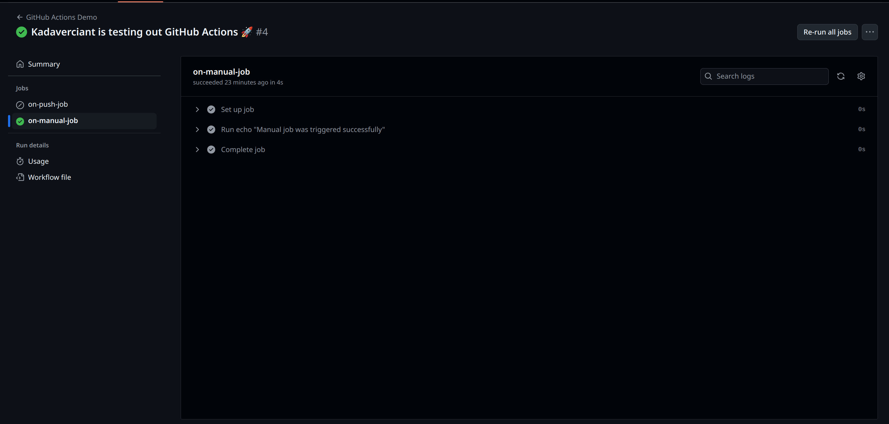
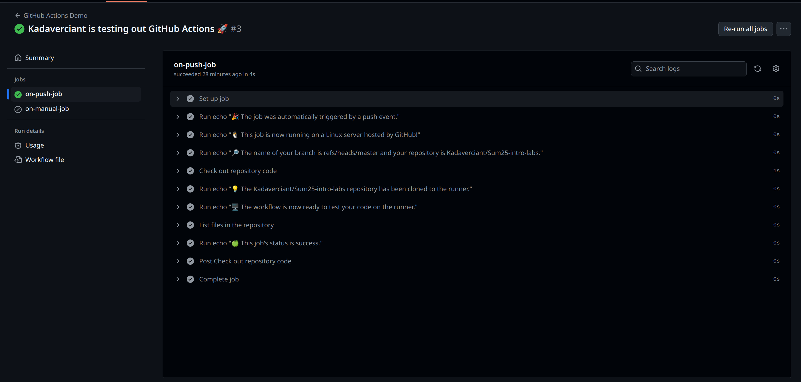
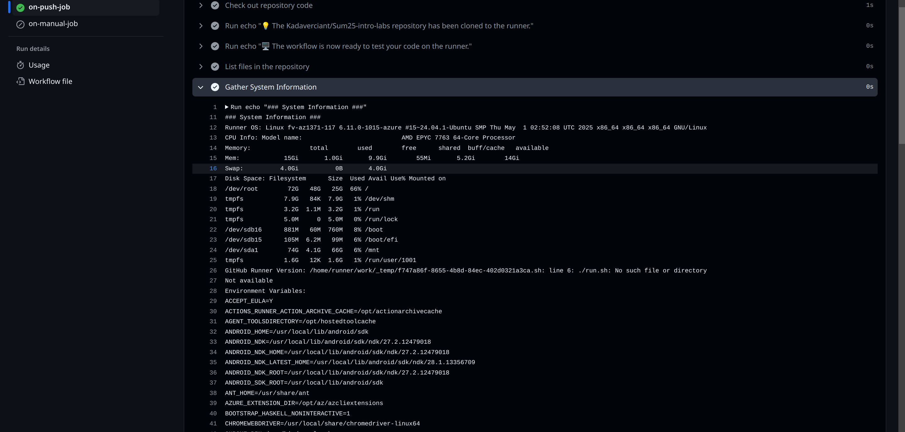

# Lab 3

## Task 1

### Observation and Actions

- Read the [quickstart guide](https://docs.github.com/en/actions/quickstart)
- Define key findings:

- - GitHub Actions is a CI/CD platform for automating build, test, and deployment pipelines.

- - Workflows can trigger actions like running tests on code pushes or deploying merged pull requests to production.
- In `.github/workflows` add file `github-actions-demo.yml` with following content: 
```yml
name: GitHub Actions Demo
run-name: ${{ github.actor }} is testing out GitHub Actions 🚀
on: [push]
jobs:
  Explore-GitHub-Actions:
    runs-on: ubuntu-latest
    steps:
      - run: echo "🎉 The job was automatically triggered by a ${{ github.event_name }} event."
      - run: echo "🐧 This job is now running on a ${{ runner.os }} server hosted by GitHub!"
      - run: echo "🔎 The name of your branch is ${{ github.ref }} and your repository is ${{ github.repository }}."
      - name: Check out repository code
        uses: actions/checkout@v4
      - run: echo "💡 The ${{ github.repository }} repository has been cloned to the runner."
      - run: echo "🖥️ The workflow is now ready to test your code on the runner."
      - name: List files in the repository
        run: |
          ls ${{ github.workspace }}
      - run: echo "🍏 This job's status is ${{ job.status }}."

```
- Commit&push changes an check the results in actions tab

### Observed results

We successfully implemented github action and can see its eeresults in dedicated tab


For example, here we can see the content of the repo

## Task 2

### Configure a Manual Trigger
In order to see the manual button we need to add `.github/workflows` in default branch (master) ([check here](https://github.com/orgs/community/discussions/58022#discussioncomment-8716372))

Also, in order to separate manual trigger from default action I decided to create separate jobs - one would run only on push and another might be triggered only manually

The resulting file is following:
```yml
name: GitHub Actions Demo
run-name: ${{ github.actor }} is testing out GitHub Actions 🚀
on: 
    push:
    workflow_dispatch:
jobs:
  on-push-job:
    if: github.event_name == 'push'
    runs-on: ubuntu-latest
    steps:
      - run: echo "🎉 The job was automatically triggered by a ${{ github.event_name }} event."
      - run: echo "🐧 This job is now running on a ${{ runner.os }} server hosted by GitHub!"
      - run: echo "🔎 The name of your branch is ${{ github.ref }} and your repository is ${{ github.repository }}."
      - name: Check out repository code
        uses: actions/checkout@v4
      - run: echo "💡 The ${{ github.repository }} repository has been cloned to the runner."
      - run: echo "🖥️ The workflow is now ready to test your code on the runner."
      - name: List files in the repository
        run: |
          ls ${{ github.workspace }}
      - run: echo "🍏 This job's status is ${{ job.status }}."
  on-manual-job:
    if: github.event_name == 'workflow_dispatch'
    runs-on: ubuntu-latest
    steps:
      - run: echo "Manual job was triggered successfully"

```

Here we can see results for manual run: 

And for automated one: 

### Gather System Information
In order to gather system info I added the following block in both `on-push-job` and `on-manual-job`:
```yml
- name: Gather System Information  
    run: |
        echo "### System Information ###"
        echo "Runner OS: $(uname -a)"
        echo "CPU Info: $(lscpu | grep 'Model name')"
        echo "Memory: $(free -h)"
        echo "Disk Space: $(df -h)"
        echo "GitHub Runner Version: $(./run.sh --version 2>&1 || echo 'Not available')"
        echo "Environment Variables:"
        printenv | sort
```

As a result I got the following config:
```yml
name: GitHub Actions Demo
run-name: ${{ github.actor }} is testing out GitHub Actions 🚀
on: 
    push:
    workflow_dispatch:
jobs:
  on-push-job:
    if: github.event_name == 'push'
    runs-on: ubuntu-latest
    steps:
      - run: echo "🎉 The job was automatically triggered by a ${{ github.event_name }} event."
      - run: echo "🐧 This job is now running on a ${{ runner.os }} server hosted by GitHub!"
      - run: echo "🔎 The name of your branch is ${{ github.ref }} and your repository is ${{ github.repository }}."
      - name: Check out repository code
        uses: actions/checkout@v4
      - run: echo "💡 The ${{ github.repository }} repository has been cloned to the runner."
      - run: echo "🖥️ The workflow is now ready to test your code on the runner."
      - name: List files in the repository
        run: |
          ls ${{ github.workspace }}
      - name: Gather System Information
        run: |
          echo "### System Information ###"
          echo "Runner OS: $(uname -a)"
          echo "CPU Info: $(lscpu | grep 'Model name')"
          echo "Memory: $(free -h)"
          echo "Disk Space: $(df -h)"
          echo "GitHub Runner Version: $(./run.sh --version 2>&1 || echo 'Not available')"
          echo "Environment Variables:"
          printenv | sort
      - run: echo "🍏 This job's status is ${{ job.status }}."
  on-manual-job:
    if: github.event_name == 'workflow_dispatch'
    runs-on: ubuntu-latest
    steps:
      - run: echo "Manual job was triggered successfully"
      - name: Gather System Information  
        run: |
          echo "### System Information ###"
          echo "Runner OS: $(uname -a)"
          echo "CPU Info: $(lscpu | grep 'Model name')"
          echo "Memory: $(free -h)"
          echo "Disk Space: $(df -h)"
          echo "GitHub Runner Version: $(./run.sh --version 2>&1 || echo 'Not available')"
          echo "Environment Variables:"
          printenv | sort
      - run: echo "🍏 This job's status is ${{ job.status }}."

```

Here we can see the information itself: 
